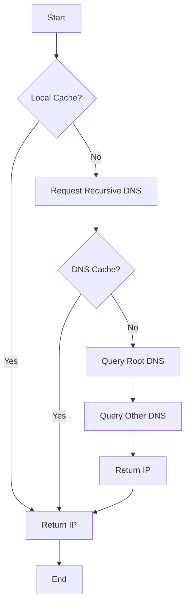

# Application (7)

Layer in which **protocols** and rules are set to determine **how the user should interact** with data sent or received.

- GUI (Graphical User Interface)
- DNS (Domain Name System)

## DNS Record Types

DNS isn't just for websites though.
There are multiple types of DNS records.

### List of most common DNS Record Types

| Type  | Explanation                                                                | Example                                  |
| ----- | -------------------------------------------------------------------------- | ---------------------------------------- |
| A     | Resolves to IPV4 addresses                                                 | 104.26.10.229                            |
| AAAA  | Resolving to IPV6 addresses                                                | 2606:4700:20::681a:be5                   |
| CNAME | Resolves to another domain name                                            | store.tryhackme.com -> shops.shopify.com |
| MX    | Resolves to the domain's email server.                                     | tryhackme.com -> alt1.aspmx.l.google.com |
| TXT   | list of servers with the authority to send emails on behalf of the domain. | IDK                                      |

## DNS Request

What happens when you make a DNS request:

1. Check Local Cache: When a domain name is requested, the computer first checks its local cache to see if the address has been looked up recently.

2. Request to Recursive DNS: If the address is not found in the local cache, a request is made to a Recursive DNS Server.

3. Check Recursive DNS Cache: The Recursive DNS Server checks its own local cache of recently looked up names.

4. Query Root DNS: If the request is not found in the recursive DNS cache, it queries the Internet's root DNS servers and other DNS servers to find the address.
